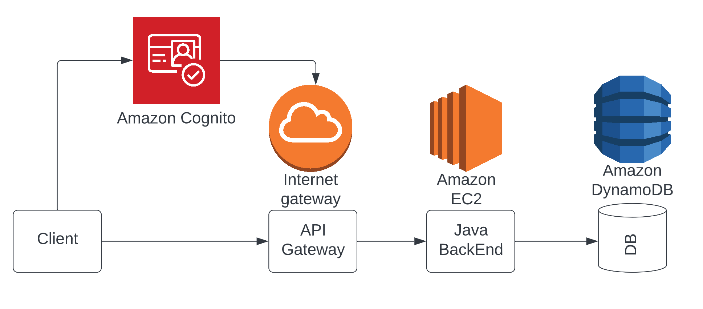
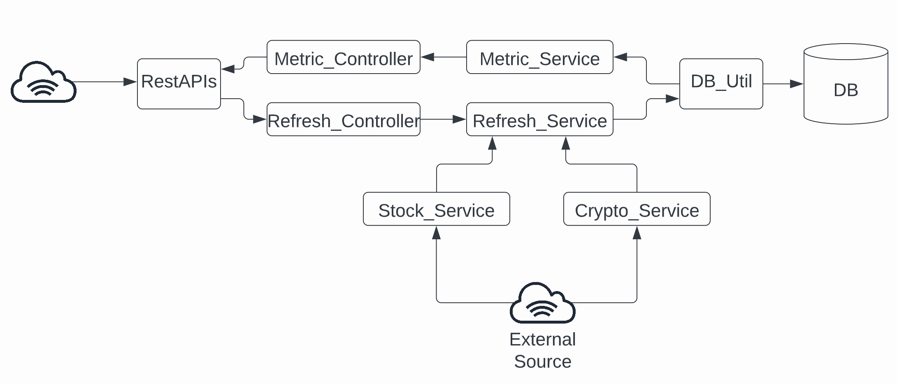

Data Tracker:

Architecture: 3-tier

BackEnd:

Project structure:

* FE/UI using Thymeleaf, templates are in resources/templates (not completed)
* Controllers:
    * Metric: /api/metric
        * getAllMetricNames()
        * getMetric(String metricName)
        * getMetricRank(@PathVariable String metricName)
    * Refresh: /api/ticker
        * addTicker(String tickerName)
* Services:
    * RefreshService: get ticker from external sources (Yahoo or CryptoWatch), and update metrics in db via dbService. Scheduled to run every 1 minute.
    * MericService: get name, metric object (for the TimeValueSeries), and rank
    * StockService: get stock info from external APIs (Yahoo)
    * CryptoService: get crypto from external APIs (CryptoWatch)
    * dbService: take care of db interaction
* Data:
    * Dtos: db to object mapping definitions
    * Repositories: store query & interaction with tables
* Utilities: common code, just have constants for now

Requirements:

* Query every 1 minute: use Spring Boot @schedule in RefreshService as an async cron job.
* Keep 24h data: use deque to keep data in Metric and remove front data that is invalid.
* Rank: start with a brute-force implementation by calculating and sort, but this would be repeated and wasted work, so it’s best to keep a data-structure that can keep a sorted order map (ex: TreeMap). Perhaps can spin this off as a service.

Improvements:

* Architecture: EC2s in auto-scale & multiple availability zones
* Change the code to multi-threading, but beware of race condition or deadlock. Recommend to keep the thread number to be close to the number physical threads.
* Testing: 
    * UnitTests, manual tests, integration tests
    * Use ELK stack to monitor
* Future feature: alert user
    * Can start with a cron or demon to keep an eye on the RefreshService. Whenever we update, it would check if the criteria are met and send a notification via a notification service (Amazon SNS). 
    * Can change to kinesis if the update is too frequent, and watch the stream.